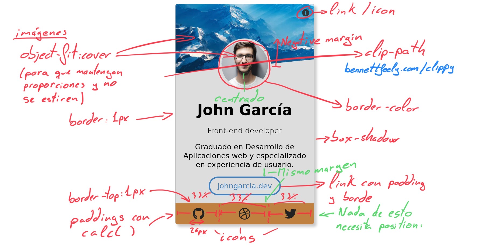

# card3
Realiza la siguiente tarjeta en código HTML/CSS.

El efecto de la imagen con biselado se puede conseguir fácilmente usando la propiedad `clip-path`. Puedes ayudarte de esta herramienta: https://bennettfeely.com/clippy/

Resultado final:

Anotaciones:

